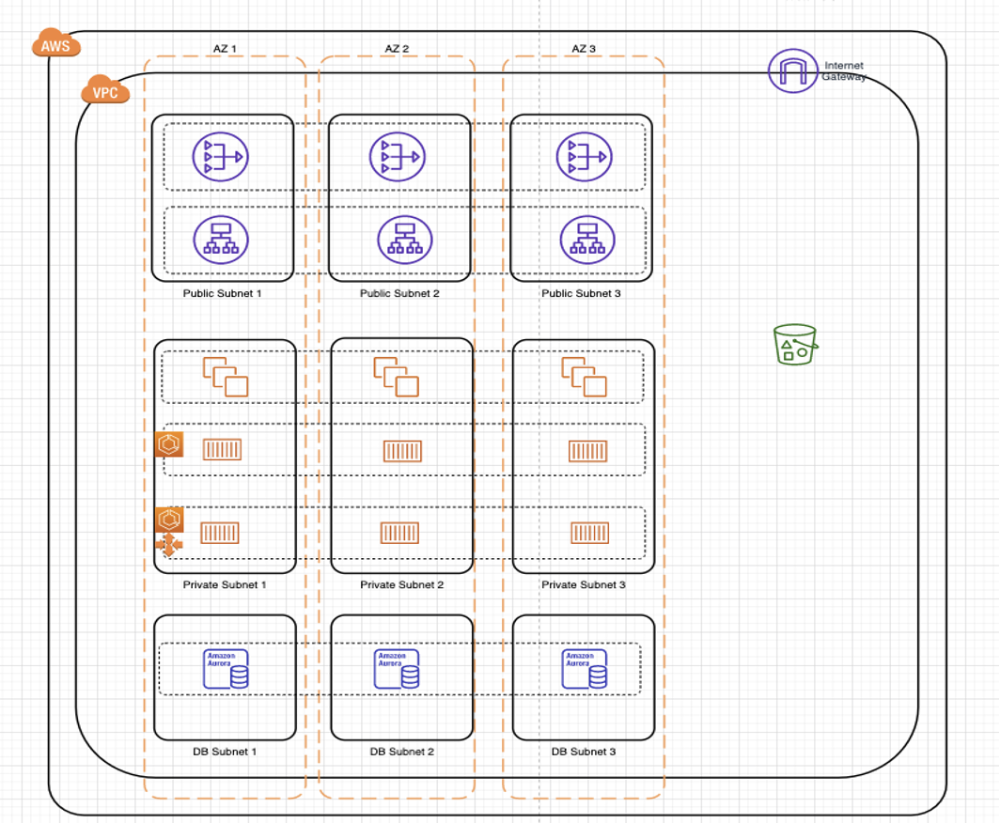

# Cloud Engineer Assignment

Duration : 1-2 weeks

```sh
export AWS_ACCOUNT_NUMBER=YOUR_ACCOUNT
export AWS_ACCESS_KEY_ID=YOUR_ACCESS_KEY_ID
export AWS_SECRET_ACCESS_KEY=YOUR_SECRET_ACCESS_KEY
export AWS_DEFAULT_REGION=us-east-1
``````

Based on the following architecture diagram, implement the infrastructure using CloudFormation in Yaml or CDK python, taking into account that:
- It should be easy to deploy and updates the infrastructure
- It should be possible to re-use the template to deploy a 2nd iteration of that infrastructure in the same AWS account and the same region
- You are free to use resource types (EC2 instance types, ECS instance type, OS, DB instance type) that you want 

1. Share your code repository with us.
2. You should also provide a plan for disaster recovery.


## Way of improvements

- Autoscaling group with launch template for ECS, RDS and EC2 service
- CloudWatch logs for VPC Flow Logs, EC2 instances, RDS databases and ECS clusters